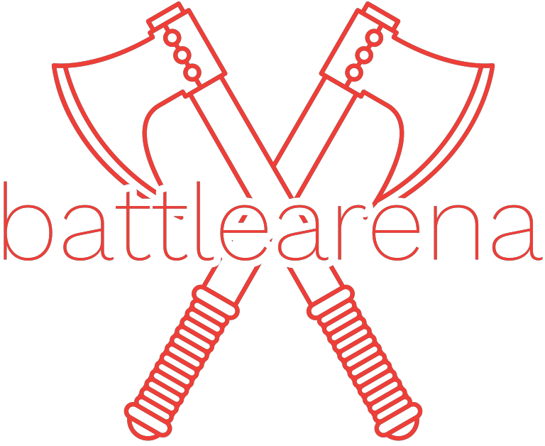

<p align="center">
  
</p>

> **Note**
> This Readme is a WIP and will be continuously updated as project grows.

# Battle Arena

This is a project which has been on my mind for sometime. It is an eSports/gaming tournament tracking platform which i am building to learn some concepts related to product engineering in general. This is the back-end. The front-end project for this can be found here: https://github.com/archdemon-developer/battle-arena-ui

## Technologies Used

Technologies used in this project are:

- typescript
- Node.js
- Fastify.js
- Mocha
- Chai
- Sinon
- Docker (coming soon)
- Istanbul (nyc)

  (Technologies used will be updated here as and when added).

## Installation

First, clone this project using git, and navigate into the project folder:

```bash
  git clone https://github.com/archdemon-developer/battle-arena-backend.git
  cd battle-arena-backend
```

Then, install the required dependencies

```bash
  npm install
```

That's it! Start the dev server using

```bash
  npm start
```

Build the project using

```bash
  npm run build
```

## Running Tests

This project uses Vitest for unit testing. To run the tests, run the following command:

```bash
  npm run test
```

If you want to see your test coverage, then run:

```bash
  npm run coverage
```

## Roadmap

**Essential Features:**

specific workflows:

- setup github actions
- swagger/openapi integrations for gateways

User flow:

- Account access (Sign Up, Login) - In progress
- Team creation
- Team members addition
- Sign in flow - can sign in as individual or as team member.
- Enter tournaments
- Search tournaments
- User/team profile edit
- Filtering
- Leaderboards
- Reporting cheaters

Admin Flow:

- Add tournaments
- Leaderboards
- User/Team management - mainly for moderation purposes

Technical Debt:

- Transaction management - In progress

**Optional Features**

Will update this as i think of more usecases.

## Acknowledgements

- [Readme.so](https://readme.so/) - To help create this readme.
- [Fastify.js](https://github.com/fastify/fastify) - The framework for this app.
